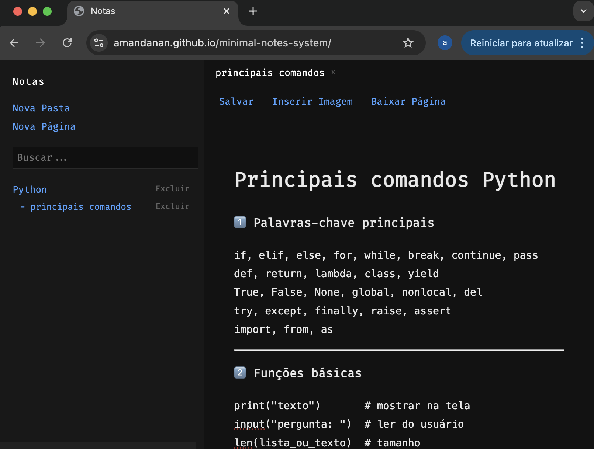

# 📝 Minimal Notes System 

Aplicação web estilo caderno com visual minimal dark.

## 🚀 Sobre

Sistema de organização de notas que permite criar pastas e páginas, com navegação por abas semelhante a um navegador.

Projeto desenvolvido para prática de manipulação de DOM, estruturação de aplicações front-end e versionamento com Git.

---

## ✨ Funcionalidades

- Criar e excluir pastas
- Criar e excluir páginas
- Sistema de abas
- Arrastar abas
- Busca por palavras
- Salvamento local
- Interface minimal dark

---

## 🛠 Tecnologias

- HTML5
- CSS3
- JavaScript (Vanilla JS)

---

## 🎯 Objetivo

Desenvolver uma aplicação organizada e escalável utilizando apenas JavaScript puro.

---

## 🚀 Próximos passos

- Versão em React
- Sincronização com Firebase
- Sistema de autenticação
- Deploy online

## 📷 Preview

